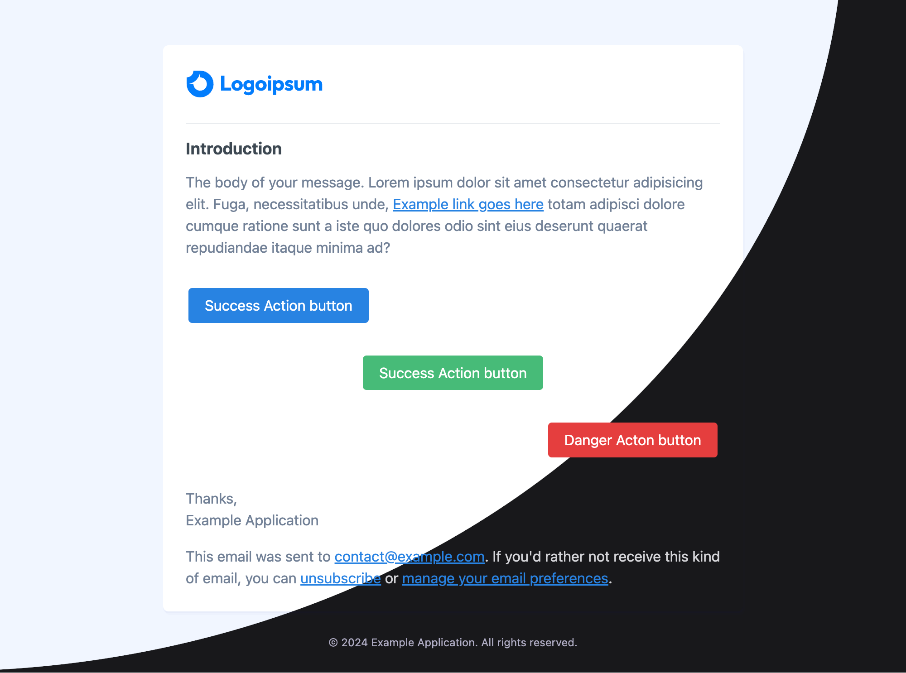

# Slick Mail

[](https://packagist.org/packages/mansoor/slick-mail)
[](https://github.com/mansoorkhan96/slick-mail/actions?query=workflow%3Arun-tests+branch%3Amain)
[](https://packagist.org/packages/mansoor/slick-mail)

Slick Mail is a simple and minimal mail theme / template for Laravel applications. It provides a fresh look, dark mode support and configuration options to set primary color and logo without publishing the views.



## Installation

You can install the package via composer:

```bash
composer require mansoorkhan/slick-mail
```

## Configuration

Once you have installed the package, you will need to instruct Laravel to load the mail views from Slick Mail. You can do so by adding following configuration to `config/mail.php` file.

```php
'markdown' => [
    'paths' => [
        __DIR__.'/../vendor/mansoor/slick-mail/resources/views',
    ],
]
```

That's it! You should be able to see a new theme in your emails.

The package provides a configuration file which allows you to change the primary color and the mail logo. You can publish the config file using:

```bash
php artisan vendor:publish --tag="slick-mail-config"
```

## Customization

You may customize the Slick Mail components and the theme CSS file. It is very similar to how you would do it for the default Laravel mail. You will need to publish the slick mail views and apply your changes.

You can publish the views using

```bash
php artisan vendor:publish --tag="slick-mail-views"
```

Make sure to update the `config/mail.php` to point to the newly published views.

```php
'markdown' => [
    'paths' => [
        resource_path('views/vendor/slick-mail'),
    ],
]
```

## Testing

```bash
composer test
```

## Changelog

Please see [CHANGELOG](CHANGELOG.md) for more information on what has changed recently.

## Contributing

Please see [CONTRIBUTING](CONTRIBUTING.md) for details.

## Security Vulnerabilities

Please review [our security policy](../../security/policy) on how to report security vulnerabilities.

## Credits

- [Mansoor Khan](https://github.com/mansoorkhan)
- [All Contributors](../../contributors)

## License

The MIT License (MIT). Please see [License File](LICENSE.md) for more information.
